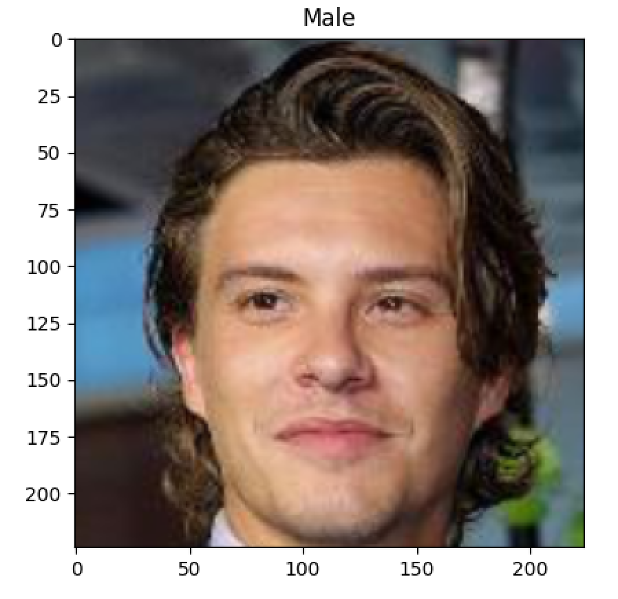
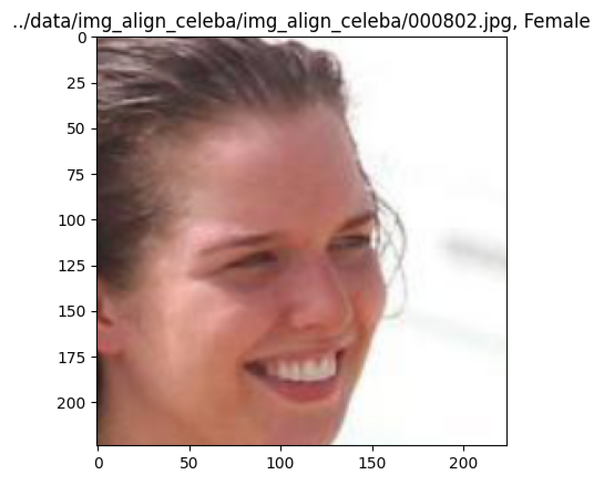
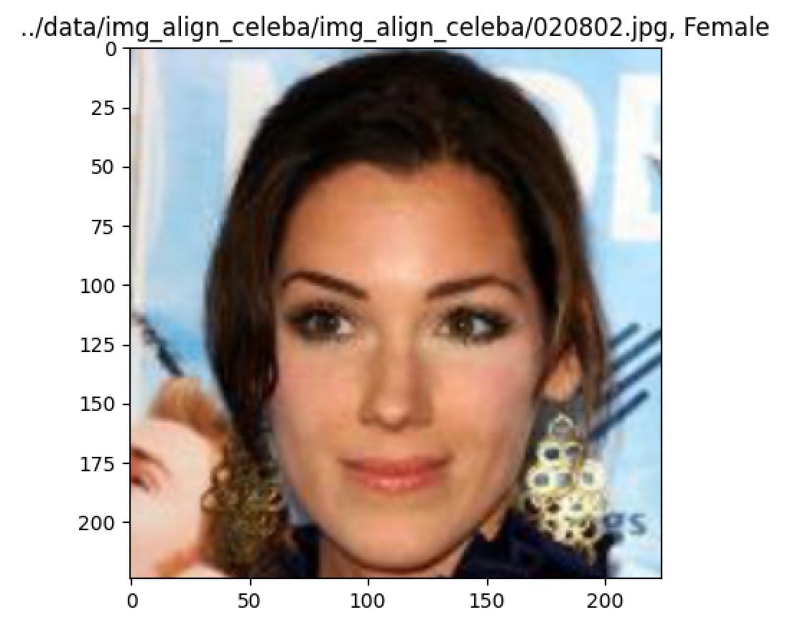

# CelebA-classifier
> Apply transfer learning to pretrained model, Resnet18, <br>
> to classify the CelebA dataset image which is a picture of a male or female <br>

# Features

- We use Resnet18 as a backbone network defined in `torchvision.models`.<br>
- As number of classes is `2` [Female(0), Male(1)], only modified fc layer as below<br>
    `model.fc = nn.Linear(in_features=512, out_features=2, bias=True)`

# Set up

- requiremnets
```
    torch==1.9.0
    torchvisionn==0.10.0
    torchsummary==1.5.1
    tqdm
    skimage
    numpy
    pandas
    matplotlib
```

# Preparing Dataset

- Structure of dataset
```
    img_align_celeba/<br>
        ├── img_align_celeba<br>
        ├── list_attr_celeba.csv<br>
        ├── list_bbox_celeba.csv<br>
        ├── list_eval_partition.csv<br>
        └── list_landmarks_align_celeba.csv<br>
```
- `list_attr_celeba.csv` is annotation csv file

- usage
```
    BATCH_SIZE = 64

    dataset = CelebA(
        root="data/img_align_celeba/", 
        csv_path="data/img_align_celeba/list_attr_celeba.csv",
        transforms=transforms.Compose([
            transforms.ToTensor(),
            transforms.Resize(256),
            transforms.CenterCrop(224),
        ])
    )

    data_loader = DataLoader(
        dataset=dataset,
        batch_size=64,
        shuffle=True,
        num_workers=8,
        pin_memory=True,
        drop_last=True
    )    
```

# Train

- args description
```
    --epochs            : default=100 
    --lr                : default=1e-4
    --batch_size        : defalut=32  
    --dset_root         : path of directory which includes celeb images (*.jpg)
    --csv_root          : annotation csv file path (list_attr_celeba.csv)  
    --ngpu              : number of gpu to use, -1 is for cpu
    --num_workers       : default=4
    --split_ratio_train : ratio of train dataset, default=0.8 
```

- usage
```
    python train.py --epochs=10 --lr=1e-4 --batch_size=64\ 
                    --dset_root="../data/img_align_celeba/img_align_celeba/" \
                    --csv_root="../data/img_align_celeba/list_attr_celeba.csv"\ 
                    --ngpu=0 --num_workers=4 --split_ratio_train=0.6
```

# Test

- args description
```
    --res18_model_root  : path of pt file of trained Resnet18 (*.pt)
    --img_file          : path of image file 
    --ngpu              : number of gpu to use, -1 is for cpu
```

- usage
```
    python test.py --res18_model_root="models/best_7_12.pt"\
                   --img_file="../data/img_align_celeba/img_align_celeba/000800.jpg"\ 
                   --ngpu=0
```

# Results






